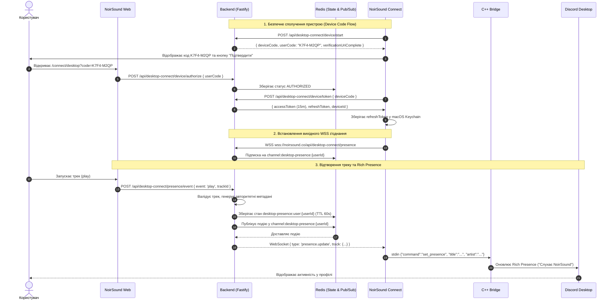

# NoirSound Connect & Discord Rich Presence — Implementation & Architecture Guide

Повна технічна документація архітектури, протоколів, інсталяції та безпеки для локального desktop-застосунку **NoirSound Connect** та інтеграції **Discord Rich Presence (Listening activity)** з платформою [NoirSound](https://noirsound.co).

---

## 1. Архітектура системи

NoirSound Connect реалізовано за моделлю **виділеного клієнтського companion app із захищеним вихідним WebSocket з’єднанням**:

```text
┌─────────────────────────────────────────────────────────────┐
│                 NoirSound Web Player                        │
│                 https://noirsound.co                        │
│         (HTML5 Audio, central player store)                 │
└──────────────────────────────┬──────────────────────────────┘
                               │ HTTPS REST:
                               │ play / pause / seek / heartbeat
                               ▼
┌─────────────────────────────────────────────────────────────┐
│                 NoirSound Backend                           │
│  ├── Перевіряє права користувача та trackId                 │
│  ├── Формує авторитетні метадані треку з PostgreSQL         │
│  ├── Зберігає короткоживучий стан у Redis (TTL 60s)         │
│  └── Публікує подію у Redis Pub/Sub                         │
└──────────────────────────────┬──────────────────────────────┘
                               │ WSS: wss://noirsound.co/api/desktop-connect/presence
                               │ (Authorization: Bearer <deviceAccessToken>)
                               ▼
┌─────────────────────────────────────────────────────────────┐
│                 NoirSound Connect                           │
│                 (macOS Desktop App)                         │
│  ├── Tauri 2 + Rust Core                                    │
│  │   ├── Token Manager (macOS Keychain)                     │
│  │   ├── WebSocket Client + Exponential Backoff             │
│  │   ├── 10s Pause Grace Timer (anti-flicker)               │
│  │   └── macOS Menu Bar / System Tray Icon                  │
│  └── React + TypeScript Interface                           │
└──────────────────────────────┬──────────────────────────────┘
                               │ IPC: stdin/stdout JSON
                               ▼
┌─────────────────────────────────────────────────────────────┐
│             noirsound-discord-bridge (C++ Sidecar)          │
│  ├── DiscordPresenceAdapter (Interface)                     │
│  ├── DiscordRpcPresenceAdapter (Official Local IPC Protocol)│
│  ├── DiscordSocialSdkAdapter (Optional Discord SDK)         │
│  └── MockDiscordPresenceAdapter (CI / Mock Fallback)        │
└──────────────────────────────┬──────────────────────────────┘
                               │ Local Discord IPC (discord-ipc-0..9)
                               ▼
┌─────────────────────────────────────────────────────────────┐
│               Discord Desktop Client                        │
│           (Listening to NoirSound Activity)                 │
└─────────────────────────────────────────────────────────────┘
```

---

## 2. Sequence Diagram (Діаграма взаємодії)



---

## 3. Device Pairing Flow

1. **Ініціалізація у застосунку**:
   - NoirSound Connect надсилає запит на `POST /api/desktop-connect/device/start`.
   - Отримує `deviceCode` (64-символьний криптографічний токен) та `userCode` (8-символьний зручний код, наприклад `K7F4-M2QP`).
2. **Підтвердження на сайті**:
   - Користувач переходить на `https://noirsound.co/connect/desktop?code=K7F4-M2QP`.
   - Якщо користувач не залогінений, сайт пропонує авторизуватися.
   - Відображається картка підтвердження пристрою із назвою (наприклад `MacBook Pro`) та платформою (`macOS`).
   - Користувач натискає **"Підключити"** (`POST /api/desktop-connect/device/authorize`).
3. **Отримання токенів**:
   - Desktop-застосунок періодично опитує `POST /api/desktop-connect/device/token`.
   - Після авторизації сервер видає:
     - `accessToken`: JWT токен (15 хв) з обмеженим scope `['desktop_presence:read', 'desktop_device:heartbeat']`.
     - `refreshToken`: 64-символьний токен, який зберігається у macOS Keychain. Сервер зберігає лише SHA-256 хеш.
     - Одноразовий `deviceCode` видаляється з Redis.

---

## 4. Backend Endpoints

| Метод | Шлях | Авторизація | Опис |
|---|---|---|---|
| `POST` | `/api/desktop-connect/device/start` | IP Rate Limited | Початок сполучення, генерація deviceCode/userCode |
| `GET` | `/api/desktop-connect/device/verify-info` | Session Auth | Отримання метаданих пристрою за кодом для сторінки підтвердження |
| `POST` | `/api/desktop-connect/device/authorize` | Session Auth | Підтвердження сполучення авторизованим користувачем |
| `POST` | `/api/desktop-connect/device/token` | Rate Limited | Polling токена для desktop-застосунку |
| `POST` | `/api/desktop-connect/device/refresh` | Device Token | Ротація refresh токена та випуск нового access токена |
| `POST` | `/api/desktop-connect/device/revoke` | Device/Session Auth | Відкликання пристрою |
| `GET` | `/api/desktop-connect/devices` | Session Auth | Список підключених пристроїв |
| `DELETE` | `/api/desktop-connect/devices/:id` | Session Auth | Відкликання підключеного пристрою |
| `GET` | `/api/desktop-connect/settings` | Session Auth | Отримання налаштувань Discord Rich Presence |
| `PATCH` | `/api/desktop-connect/settings` | Session Auth | Оновлення налаштувань Discord Rich Presence |
| `POST` | `/api/desktop-connect/presence/event` | Session Auth | Відправка подій плеєра (`play`, `pause`, `seek`, `ended`, `heartbeat`) |
| `GET` | `/api/desktop-connect/presence` | Bearer Device Token | WebSocket endpoint для зв’язку з NoirSound Connect |

---

## 5. WebSocket Protocol

### Handshake & Headers
- URL: `wss://noirsound.co/api/desktop-connect/presence`
- Заголовок: `Authorization: Bearer <deviceAccessToken>`

### Формат повідомлень від сервера
1. **Ready / Initial State**:
```json
{
  "version": 1,
  "type": "connection.ready",
  "deviceId": "device-uuid",
  "settings": {
    "enabled": true,
    "showCover": true,
    "showTimer": true
  }
}
```

2. **Presence Update**:
```json
{
  "version": 1,
  "type": "presence.update",
  "sequence": 42,
  "occurredAt": "2026-08-21T10:00:00.000Z",
  "track": {
    "id": "track-uuid",
    "title": "Midnight Reverie",
    "artistName": "Shadow Artist",
    "albumTitle": "Dark Waves",
    "durationMs": 214000,
    "positionMs": 37000,
    "coverUrl": "https://noirsound.co/api/public/covers/track-uuid",
    "shareUrl": "https://noirsound.co/track/track-uuid"
  }
}
```

3. **Presence Pause**:
```json
{
  "version": 1,
  "type": "presence.pause",
  "sequence": 43,
  "occurredAt": "2026-08-21T10:00:15.000Z"
}
```

4. **Presence Clear**:
```json
{
  "version": 1,
  "type": "presence.clear",
  "sequence": 44,
  "occurredAt": "2026-08-21T10:00:30.000Z"
}
```

5. **Device Revoked**:
```json
{
  "type": "device.revoked",
  "message": "This device connection was revoked."
}
```

---

## 6. Redis Keys та TTL

| Ключ | TTL | Опис |
|---|---|---|
| `desktop-pairing:code:{deviceCode}` | 600 секунд (10 хв) | Тимчасовий стан сполучення (`PENDING` / `AUTHORIZED`) |
| `desktop-pairing:user:{userCode}` | 600 секунд (10 хв) | Маппінг короткого коду `userCode` -> `deviceCode` |
| `desktop-presence:user:{userId}` | 60 секунд (під час гри) / 15 секунд (пауза) | Кеш поточного треку для миттєвої віддачі при підключенні |
| `channel:desktop-presence:{userId}` | N/A (Pub/Sub) | Канал для доставки подій активним desktop WebSocket підключенням |

---

## 7. Prisma Schema

Додано сутність `DesktopConnectionDevice` та налаштування Discord до моделі `User`:

```prisma
model User {
  // ... наявні поля
  discordPresenceEnabled   Boolean   @default(false)
  discordPresenceShowCover Boolean   @default(true)
  discordPresenceShowTimer Boolean   @default(true)
  desktopDevices DesktopConnectionDevice[]
}

model DesktopConnectionDevice {
  id               String    @id @default(uuid())
  userId           String
  deviceName       String
  platform         String
  appVersion       String
  refreshTokenHash String
  tokenFamilyId    String?   @default(uuid())
  rotationCounter  Int       @default(0)
  lastSeenAt       DateTime  @default(now())
  revokedAt        DateTime?
  createdAt        DateTime  @default(now())
  updatedAt        DateTime  @updatedAt

  user User @relation(fields: [userId], references: [id], onDelete: Cascade)

  @@index([userId, revokedAt])
  @@index([refreshTokenHash])
}
```

---

## 8. Discord SDK Setup & Expected Directory

### Application Configuration
- **Discord Application ID**: `1540281435296895066`
- **Rich Presence Asset Key**: `noirsound` (логотип NoirSound у Discord Developer Portal)

### Очікувана структура директорії SDK
Скрипт налаштування створює таку структуру:
```text
vendor/discord-social-sdk/
├── include/
│   └── discord.h
├── lib/
│   └── arm64/
│       └── libdiscord_game_sdk.dylib
└── bin/
```

### Скрипти налаштування та перевірки:
1. `scripts/setup-discord-social-sdk.sh`: створює структуру папок `vendor/discord-social-sdk/`.
2. `scripts/verify-discord-social-sdk.sh`: перевіряє наявність заголовків та arm64 бібліотек.

---

## 9. Збірка для macOS

### Збірка C++ Sidecar:
```bash
cd desktop/noirsound-connect/sidecar
mkdir -p build && cd build
cmake ..
cmake --build .
```

### Збірка desktop-застосунку (DMG / .app):
```bash
cd desktop/noirsound-connect
npm run build
npm run tauri build
```

---

## 10. Запуск у Development та Mock Mode

### Запуск вебсервера та бекенду:
```bash
# Backend
cd backend && npm start

# Web Frontend
npm run dev
```

### Запуск NoirSound Connect (Mock Mode):
Застосунок автоматично запускається з `MockDiscordPresenceAdapter`, якщо офіційний SDK не підключено:
```bash
cd desktop/noirsound-connect
npm run tauri dev
```

---

## 11. Security & Privacy

1. **Безпека авторизації**:
   - Жодних Discord OAuth, Bot токенів або Client Secrets.
   - Refresh токени зберігаються виключно в системному macOS Keychain через Rust `keyring`.
   - Access токени існують лише в оперативній пам'яті (TTL 15 хв).
2. **Приватність**:
   - Не передаються аудіофайли чи посилання на стрімінг.
   - Не передаються cookie браузера чи паролі.
   - Desktop-застосунок отримує виключно публічні метадані поточного треку: назва, артист, альбом, обкладинка, посилання на трек.
3. **Авторитетність бекенду**:
   - Web плеєр надсилає лише `trackId` та позицію.
   - Всі метадані (назва, виконавець, валідований URL обкладинки) формуються виключно бекендом.
   - Захист від XSS та injection через Unicode-safe truncation та URL allowlist.

---

## 12. Майбутня підтримка Windows

Архітектура закладена з повною кросплатформеністю:
- **Rust Tauri Core**: використовує `keyring` (підтримує Windows Credential Manager) та стандартний `tokio-tungstenite`.
- **C++ Sidecar**: CMake конфігурація готова до лінкування `discord_game_sdk.dll` на Windows x64/arm64.
- **IPC Protocol**: стандартний newline-delimited JSON через `stdin`/`stdout`.
